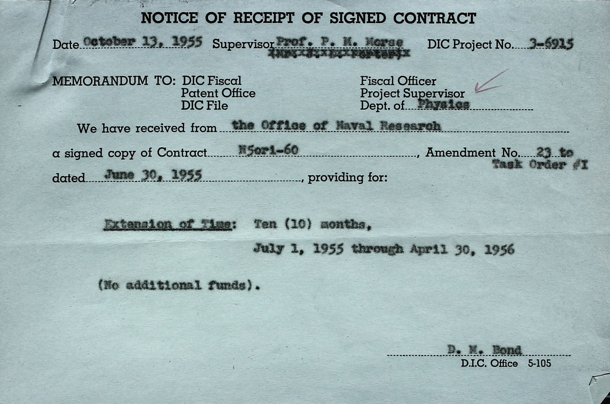
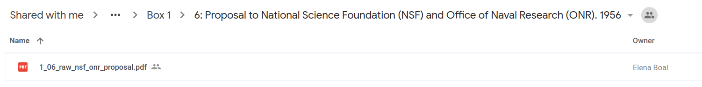

# Metadata Conventions

This file gathers all of our conventions for gathering the metadata for the history of the 
Compution Center project. 
Feel free to make changes to this file but be sure to alert Carol (metadata specialist) to any 
changes.

### Files and Folders
Please enter the metadata to the 
[metadata google sheet.](https://docs.google.com/spreadsheets/d/1LU05c0lTSTQ9IY3RS4eDcyvq5HNBMx6mbuMJe6TX-ZA/edit?usp=sharing)

The [scanned documents](https://drive.google.com/drive/u/0/folders/13YcKYIsK2vv_zXwnGECTnNgAvKizu4PL) 
are on google drive. Note: you might have to request access from one of the staff members.

Note: Each incoming pdf is pre-processed by Elena Boal. The name of the file can be used to extract
information. For example:

1_2_project_proposal_contract_raw.pdf means:

1 -> Box

02 -> Folder number 

project_propsoal_contract -> short foldername

raw -> the pdf has not been ocred (otherwise it would say "ocr")

## General Rules

**No empty cells except for metadata_specialist notes**

Every cell needs to be filled in the sheet because of some quirks with the google sheets api. 
Hence, use "None" as a null value, e.g. if a document has no recipients. 

**Skip scans of the folder themselves**

Often, the first page of a pdf will be scan of the beige folder. We use this to identify the 
beginning and end of the folder when merging multiple incoming scan pdfs. However, those folders 
aren't documents themselves and you should just skip them.

**Don't add comments on the google sheets**

We can't export the comments. If you have notes on the document that describe the document, add 
them to the "notes" column. If you are uncertain about how to classify a document or similar, use
 the "metadata_specialist_notes" column usually reserved for Carol and enter your comment with 
 your name, e.g. "//Stephan: Is this a letter or a contract?"
 
**Don't spend too much time on a document**

We want to add the metadata for as many documents as possible as quickly as possible so our 
django team has a set of documents to work with in their development. Hence, we don't expect you 
to read the full document to decide on the best title for a document. Skim the first paragraph if
 necessary but don't spend too much time on one document.
 
**Ignore recipients and ccs on very short documents.**

If you are dealing with a very short, uninformative document with many recipients, don't enter 
the recipients or ccs. Here's an example:

Technically, the recipients are "DIC Fiscal," "Patent Office," "DIC File," "Fiscal Officer," "Project 
Supervisor," and "Department of Physics." However, the primary purpose of the recipient/cc data 
is to use it for our social network analysis. This document is not very useful for this purpose 
(unless you are really interested in the intricacies of grant administration).
 

## Metadata Fields

#### box
**Description:** Which of the three boxes the document stems from. Can be found through the google 
drive
folder structure or the filename of the pdf (see above).

**Valid values:** 1-3

&nbsp;
#### folder_number
**Description:** Number of the folder within the box. Can be fonud through the google drive folder
structure or the filename of the pdf (see above).

**Valid values:** 1-37

&nbsp;
#### foldername_short
**Description:** An abberviate version of the full foldername that we can use to create pdf files of
 the
individual documents. 
Feel free to assign this foldername in a way that seems reasonable to you.

**Examples**

"Project proposal, contract correspondence, Division of Industrial Cooperation (DIC) # 5 6915. 
1950-1956" becomes project_proposal_contract

or: 

"Rockefeller Foundation, 1956-1959" becomes rockefeller

**Valid values:** Can only contain lower case characters and underscores. 

&nbsp;
#### foldername_full 
**Description:** The full foldername as assigned by the MIT archives. You can find it on the google 
drive.

**Example**

In this case, the full foldername is "Proposal to the National Science Foundation (NSF) and the 
Office of Naval Research (ONR). 1956" Note: Don't include the folder number ("6:")

&nbsp;
#### doc_id
**Description:** Designates that this is the n-th document in the folder. Restarts with each 
folder, so the first document for each folder has doc_id 1. The next document has doc_id 2 and so
 on.
 
 **Valid values**: int
 
 &nbsp;
 #### filename
 **Description:** Automatically generated filename for the future pdf and txt file created for this
 document. 
 
 **Note**: As soon as you enter a box number on a line, the filename should get automatically 
 generated. If that is not the case, try to copy the code from a cell above or send a slack message
 to Stephan.
 
 &nbsp;
 #### author
 **Description:** The author or authors of the document. 
 
 **Rules:**
 
 * Whenever possible use auto-complete.
 * Last name first followed by first name and initials (as far as provided)
     * "F. J. Corbato" becomes "Corbato, F. J." in the metadata sheet   
 * Multiple authors are separated by a semicolon. 
    * "F. J. Corbato and Philip M. Morse" becomes "Corbato, F. J.; Morse, Philip M." in the 
    metadata sheet
 * If the document was written by an institution but no individual author is identified, use that 
 institution's name.  
    * In the case of the "Office of Naval Research," use the abbreviation "ONR" and make sure to 
    identify which ONR office created the document. 
    * "Office of Naval Research, Washington D.C." becomes "ONR/Washington"
 * If the document has no identifiable author, use "Unknown". 

&nbsp;
#### title
**Description:** The title of the document, either extracted from the document or assigned by us.

**Rules:**
* Whenever possible try to use the title used in the document. 
* If the document has no discernible title, assign a title that describes the document.
    * If the document is a letter to Philip Morse, the title could be "Letter to Philip Morse"
    * If the document is a research contract, you could assign a title like "Continuation of Contract N5ori06001"
* Don't use "None" if the document has no title. For example, if it's just an empty sheet, assign
 the title "Empty Sheet".
 
&nbsp;
#### date
**Description:** The date of the document. 

**Rules:**
* Use the format YYYY-MM-DD. 
* If the document doesn't have a date, use "None"  

&nbsp;
#### first_page and last_page
**Description:** first_page and last_page identify the page on which a document starts and ends.
 We 
use these fields to split our pdfs of a whole folder into individual documents. 

**Rules:**
* The page numbers are inclusive, so if you set last_page to 42 that means that page 42 is still 
part of the document. 
* If a document only has a single page, the first_page and the last_page are the same. 

&nbsp;
#### metadata_added_by
**Description:** Lists who added the metadata. On the one hand, this is useful for the metadata 
specialist to contact you if modifications to your entered metadata are necessary. On the other 
hand, it gives us a way to track who is working too much or too little on the metadata task.

&nbsp;
#### doc_type
**Description:** The type or types of the document (as discerned by quickly scanning the document)
, for example "letter", "research report", or "proposal". Note: We may or may not find uses for 
the document types. Don't spend too much time on them in case they turn out not to be very useful.

**Rules**
* We may standardize the types in the future. For now, assign the document types that seem 
reasonable to you.
* Multiple document types need to be separated by a semicolon.    
* The distinction between letter and memo is subtle. Memo refers to professional communication 
within an 
organization, for example for a document sent from the Physics department to the Computation 
Center. Letter refers to a more personal exchange. 

&nbsp;
#### recipients
**Description:** The recipient or recipients of a document (if any).

 **Rules:**
 
 * Whenever possible use auto-complete.
 * Last name first followed by first name and initials (as far as provided)
     * "F. J. Corbato" becomes "Corbato, F. J." in the metadata sheet   
 * Multiple recipients are separated by a semicolon. 
    * "F. J. Corbato and Philip M. Morse" becomes "Corbato, F. J.; Morse, Philip M." in the 
    metadata sheet
 * If the document was sent to an institution but no individual author is identified, use that 
 institution's name.  
    * In the case of the "Office of Naval Research," use the abbreviation "ONR" and make sure to 
    identify which ONR office created the document. 
    * "Office of Naval Research, Washington D.C." becomes "ONR/Washington"
 * If the document has no receiver / it was not sent to anyone, use "None".
 * If you are certain that there were recipients, use "None" but add in "notes" that there were 
 recipients but that they couldn't be identified.
 
 &nbsp;
 #### cced
 **Description:** The person or people cced (if any). If you are not certain if a person is a 
 recipient or was cced, put them under recipients. 
 
 **Rules:**
 Same as for recipients.
 
 &nbsp;
#### notes
**Description:** Your notes about the document. These should relate to or directly describe 
the document. Put internal discussions (is this a letter or a memo?) into the 
metadata_specialist_notes. 

**Examples**
* Page 4 is missing
* Recipients mentioned but not listed. 
* Author illegible

&nbsp;
#### metadata_specialist_notes
**Description:** Notes either by the metadata specialist (Carol) or questions/discussions about 
the document. This is the place to discuss if a title was properly assigned, if a document should
 be classified differently, or any other things that remained unclear.
 
 **Examples:** 
 * //stephan: is this a letter or a memo
 * //stephan: I think the date is 1956-04-28 but it's almost illegible. Can someone confirm?
 
 
 ## Final Note
 If you have further questions or comments about adding the metadata, please contact our metadata
  specialist Carol or a staff member.
