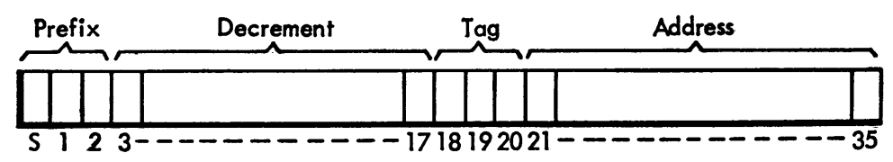
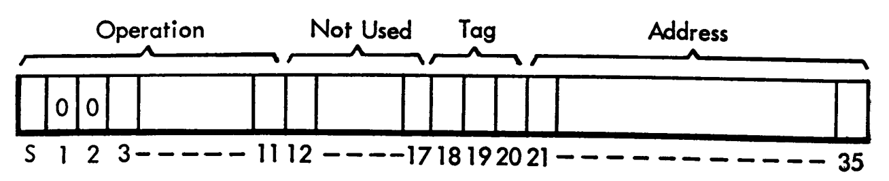
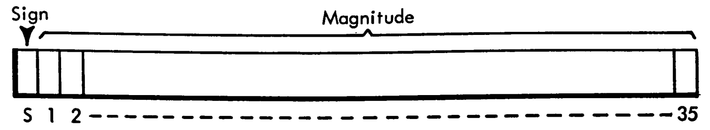
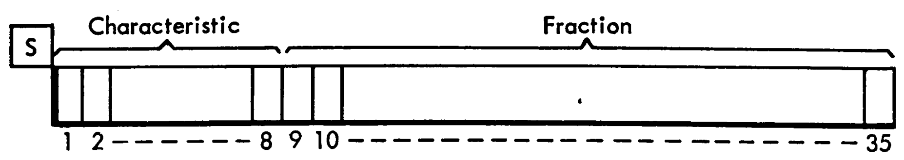

# Words in the IBM 704

The IBM 704's general memory was composed of 36-bit words.  Words could be either instructions or
numbers, but there was nothing in the word that indicated which it would be.  It was the role of
the programmer to separate the memory for the program's instructions and the data it was 
manipulating.  

## Instructions

There are two kinds of instructions: Type A and Type B.  Each instruction consists of the 
operation, the address, the tag, and in the case of Type A instructions, a decrement, with each 
of these things occupying a different set of bits.  

The address describes which register in the general memory that the operation will target.  

The operation describes the specific action that the computer will take; for example, `CLA 100` 
will take the contents of register 100 and replace the accumulator with that value.  Of course, 
in the machine, the operation wouldn't be represented by `CLA`, it would be `000101000000` in 
memory, or `+0500` in octal as it is often written in the manuals.  

The tag is three bits corresponding to the A, B, and C index registers of the IBM 704.  For 
example `100` would refer to the A register, `010` to the B register, and `110` to both the A 
and B register.  It is also possible to leave the tag as `000`, which is like an imaginary 
register which always has a value of 0.  The effect of the tag is to decrement the target address by 
whatever is stored in that index register.  For example if index register B (IRB) contains 10, 
`CLA 100, 2` would cause `CLA` to act on register 90 instead of register 100.  (Remember that 2 
in decimal is 010 in binary).

### Type A Instructions

There are only five Type A instructions.  For these, the first three bits represent the 
operation.  Type A instructions are distinguished by the computer by the fact that bits 1 and 2 
are not both 0 (note that bit 1 is the second bit, as bit 0 is the first bit).  Bits 3 - 17
contain the numerical value of the decrement, bits 18 - 20 contain the tag, and the remaining 
bits 21-35 contain the address.  

If the value of the index register specified by the tag is greater than the decrement, then the 
index register is reduced by the decrement.  Otherwise, the computer will go back to the address specified.  
This allows for looping.  

### Type B Instructions

Most instructions are Type B instructions.  All Type B instructions have bits 1 and 2 equal to 0
.  The first 12 bits represent the 
operation, while the tag and address occupy the same location as in Type A instructions (18-20 and
 21-35 
respectively).  Bits 12-17 aren't used. 

Note that the operation has a sign bit.  For whatever reason, it is conventional to refer to 
operations octal values as signed.  Thus, `100101000000` would not be `4500` in octal but `-0500`.  

## Numbers

### Fixed Point

The first bit of the word in a fixed point number is the sign.  If the sign bit is `1`, then the 
number is negative, and if it is `0`, the number is positive.  The remaining bits constitute the 
magnitude of the number.  The computer has no encoding for the binary point (basically decimal 
point for binary numbers).  However, in theory one can imagine it to be wherever 
one wants, creating a convention that the binary point will always be between the n and n+1-th 
bit for a program.  

### Floating Point

Similarly to a fixed point number, the first bit of the word in a floating point number is the sign.
  If the sign bit is `1`, then the 
number is negative, and if it is `0`, the number is positive.  

A floating point number is represented as `B×2ᵇ`

Bits 9 - 35 represent the 
magnitude of `B`, with the binary point to the left of bit 9, and are called the 
fraction.  Bits 1-8 are called the characteristic, and have the value of `b+128`.  This allows 
`b` to be negative, allowing for values less than one-half.  

For more information, check out [the IBM 704 manual](http://bitsavers.org/pdf/ibm/704/24-6661-2_704_Manual_1955.pdf).  